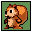
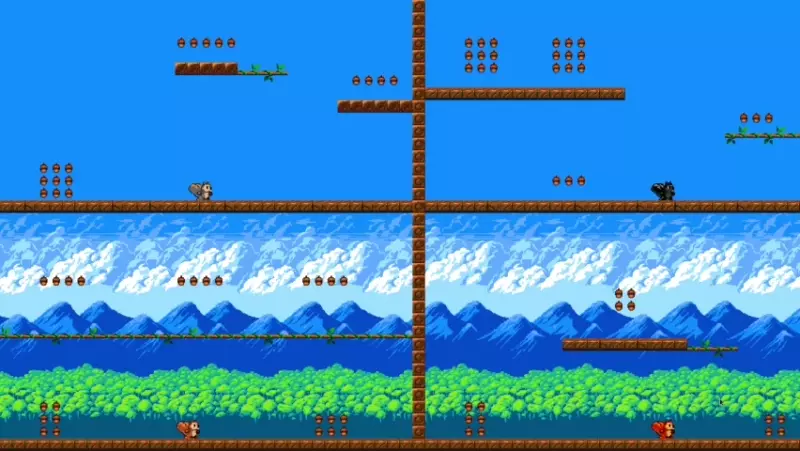
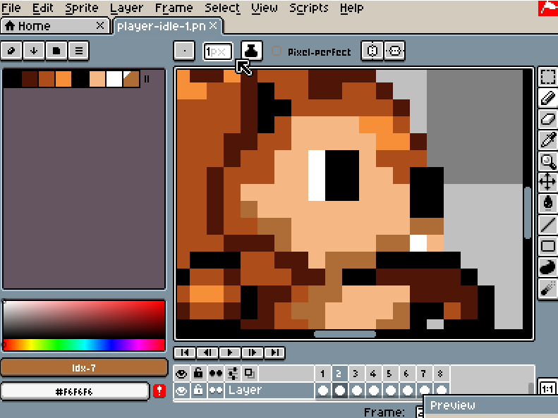
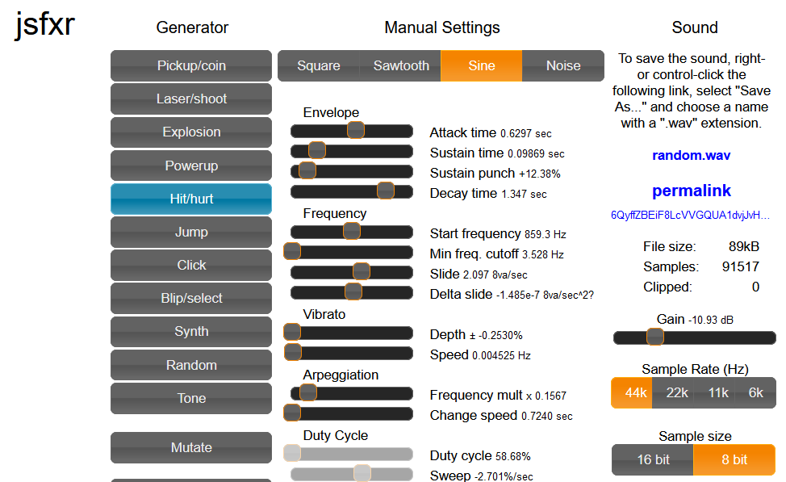

MOVED TO https://codeberg.org/devnewton/webkorisu

# webkorisu

Simple game with squirrels.

## Licenses

Unless stated otherwise, everything is under MIT license.

Some assets are under CC0 or CC-BY license as noted in LICENSE.md files in project folders.

## Acknowledgements

Thanks to [Libresprite](http://www.libresprite.org/) developers. I use it to draw my sprites.

Thanks to [jsfxr](https://sfxr.me/) authors, I use it for sound effects.

Thanks to [Tiled](https://www.mapeditor.org/) developers. I use it for level edit.

